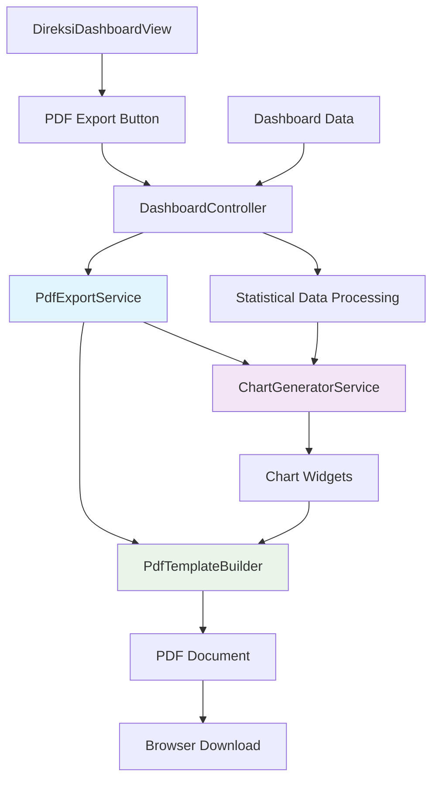
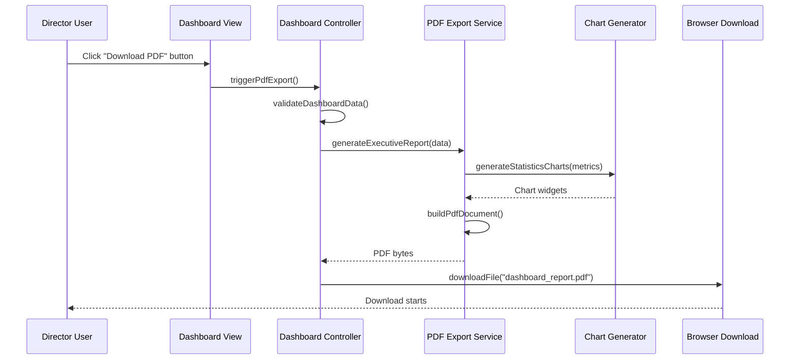
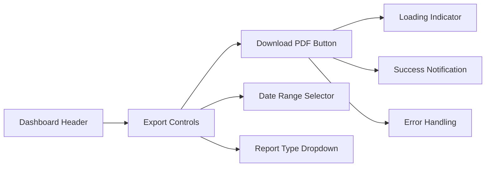
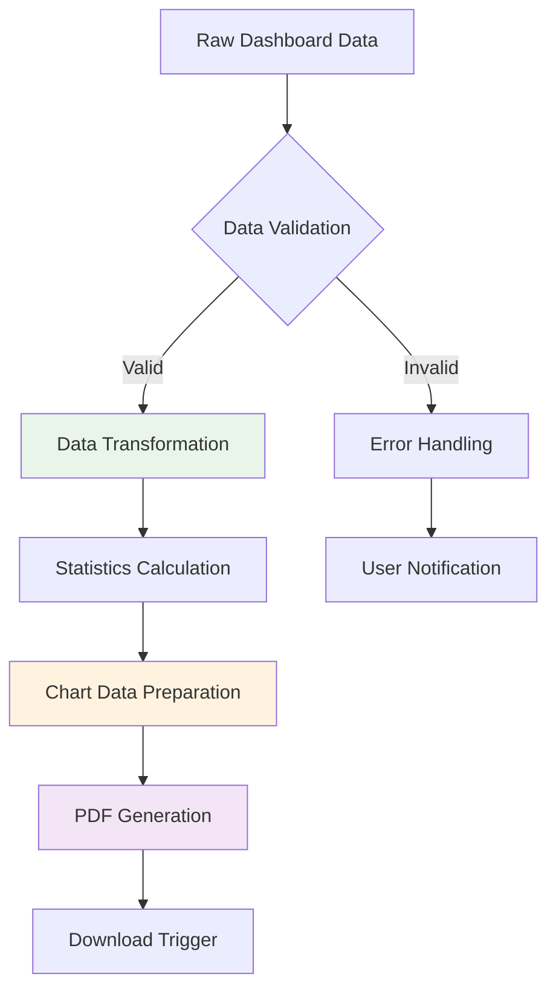
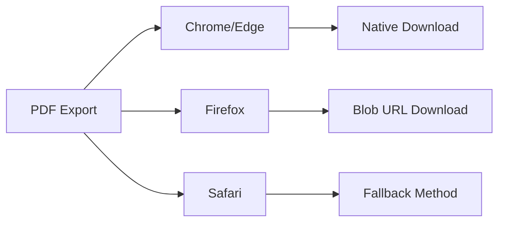

# Director Dashboard PDF Export Feature Design

## Overview

This feature adds PDF export functionality to the director (Direksi) dashboard, allowing executives to download comprehensive reports containing dashboard statistics with visual charts. The exported PDF will include ticket metrics, priority distributions, and performance analytics in a professional format suitable for executive reporting.

## Technology Stack & Dependencies

### Current Dependencies
- **Framework**: Flutter Web with GetX state management
- **HTTP Client**: http ^1.2.1 for API communication
- **State Management**: GetX ^4.6.6 for reactive programming
- **Data Persistence**: get_storage ^2.1.1 for local storage

### New Dependencies Required
- **pdf**: ^3.10.4 - Core PDF generation library
- **printing**: ^5.11.0 - Web-compatible PDF downloading
- **fl_chart**: ^0.65.0 - Chart generation for statistics visualization
- **universal_html**: ^2.2.4 - Web-specific HTML rendering utilities

## Architecture

### Component Structure



### Data Flow Architecture



## Core Components

### 1. PDF Export Service

```dart
class PdfExportService {
  static Future<Uint8List> generateDashboardReport({
    required DireksiDashboardStats stats,
    required String reportTitle,
    required DateTime generatedAt,
  }) async
  
  static Future<pw.Widget> _buildCoverPage()
  static Future<pw.Widget> _buildExecutiveSummary()
  static Future<pw.Widget> _buildStatisticsSection()
  static Future<pw.Widget> _buildChartsSection()
}
```

### 2. Chart Generator Service

```dart
class ChartGeneratorService {
  static Future<Uint8List> generateTicketStatusChart(List<Map<String, dynamic>> data)
  static Future<Uint8List> generatePriorityDistributionChart(List<Map<String, dynamic>> data)
  static Future<Uint8List> generateUnitPerformanceChart(List<Map<String, dynamic>> data)
  static Future<Uint8List> generateTrendAnalysisChart(Map<String, dynamic> metrics)
}
```

### 3. Dashboard Controller Enhancement

```dart
// Extension to existing DashboardController
class DashboardController extends BaseController {
  // Add PDF export functionality
  final RxBool isGeneratingPdf = false.obs;
  
  Future<void> exportDashboardToPdf() async
  Future<void> _validateExportData() 
  void _triggerDownload(Uint8List pdfBytes, String filename)
}
```

## PDF Document Structure

### Document Layout

```mermaid
graph TD
    A[PDF Document] --> B[Cover Page]
    A --> C[Executive Summary]
    A --> D[Statistics Overview]
    A --> E[Visual Analytics]
    A --> F[Appendix]
    
    B --> B1[Company Header]
    B --> B2[Report Title]
    B --> B3[Generation Date]
    B --> B4[Director Information]
    
    C --> C1[Key Metrics Summary]
    C --> C2[Performance Highlights]
    C --> C3[Critical Insights]
    
    D --> D1[Total Tickets]
    D --> D2[Active Tickets]
    D --> D3[Completed Tickets]
    D --> D4[Priority Breakdown]
    
    E --> E1[Ticket Status Chart]
    E --> E2[Priority Distribution Chart]
    E --> E3[Unit Performance Chart]
    E --> E4[Trend Analysis Chart]
    
    F --> F1[Data Sources]
    F --> F2[Methodology Notes]
    F --> F3[Contact Information]
```



### Chart Specifications

| Chart Type | Data Source | Visualization |
|------------|-------------|---------------|
| Ticket Status | `direksiExecutiveSummary.ticketsByStatus` | Pie Chart |
| Priority Distribution | `direksiPriorityDistribution` | Donut Chart |
| Unit Performance | `direksiUnitPerformance` | Bar Chart |
| Performance Metrics | `direksiPerformanceMetrics` | Line Chart |

## Feature Implementation

### 1. UI Integration

#### Export Button Component


#### Button Specifications
- **Position**: Top-right corner of dashboard header
- **Icon**: Download icon with PDF symbol
- **States**: Normal, Loading, Disabled
- **Permissions**: Direksi role only

### 2. Data Processing Pipeline



### 3. Chart Generation Process

#### Ticket Status Chart
- **Type**: Pie Chart
- **Data**: Total, Open, In Progress, Closed tickets
- **Colors**: Primary theme colors
- **Labels**: Percentage and count values

#### Priority Distribution Chart
- **Type**: Donut Chart
- **Data**: High, Medium, Low priority tickets
- **Colors**: Red, Orange, Green respectively
- **Center**: Total ticket count

#### Unit Performance Chart
- **Type**: Horizontal Bar Chart
- **Data**: Tickets resolved per unit
- **Sort**: Descending by performance
- **Labels**: Unit names and resolution counts

### 4. Error Handling Strategy

```mermaid
graph TD
    A[PDF Export Request] --> B{Data Available?}
    B -->|No| C[Show "No Data" Message]
    B -->|Yes| D{Internet Connection?}
    D -->|No| E[Show "Offline" Message]
    D -->|Yes| F{PDF Generation}
    F -->|Success| G[Download File]
    F -->|Error| H[Show Error Message]
    
    C --> I[Suggest Data Refresh]
    E --> J[Suggest Retry Later]
    H --> K[Provide Error Details]
```

## API Integration

### New API Endpoint Requirements

```http
GET /api/v1/dashboard/direksi/export-data
Authorization: Bearer {token}
Query Parameters:
  - start_date: string (optional)
  - end_date: string (optional)
  - include_charts: boolean (default: true)

Response:
{
  "success": true,
  "data": {
    "executive_summary": {...},
    "performance_metrics": {...},
    "priority_distribution": [...],
    "unit_performance": [...],
    "export_metadata": {
      "generated_at": "2024-01-15T10:30:00Z",
      "data_period": "2024-01-01 to 2024-01-15",
      "total_records": 1250
    }
  }
}
```

### Enhanced Dashboard Controller Methods

```dart
Future<Map<String, dynamic>> getExportData({
  DateTime? startDate,
  DateTime? endDate,
}) async {
  final params = <String, String>{};
  if (startDate != null) params['start_date'] = startDate.toIso8601String();
  if (endDate != null) params['end_date'] = endDate.toIso8601String();
  params['include_charts'] = 'true';
  
  final response = await apiService.get('/dashboard/direksi/export-data', params);
  return response.body['data'];
}
```

## Testing Strategy

### Unit Tests
- PDF generation with valid data
- Chart creation for different data sets
- Error handling for missing data
- File download functionality

### Integration Tests
- End-to-end PDF export flow
- API data fetching and processing
- User permission validation
- Cross-browser download compatibility

### Test Data Scenarios
```dart
final mockDashboardData = {
  'executive_summary': {
    'total_tickets': 1250,
    'active_tickets': 180,
    'completed_tickets': 1070,
    'completion_rate': 85.6
  },
  'priority_distribution': [
    {'priority': 'High', 'count': 45, 'percentage': 3.6},
    {'priority': 'Medium', 'count': 756, 'percentage': 60.5},
    {'priority': 'Low', 'count': 449, 'percentage': 35.9}
  ]
};
```

## Security Considerations

### Access Control
- Restrict PDF export to Direksi role only
- Validate user permissions before data access
- Log export activities for audit trail

### Data Protection
- Ensure exported data matches user's access level
- Remove sensitive information from exports
- Implement rate limiting for export requests

### File Security
- Generate PDFs client-side to avoid server storage
- Use secure random filenames
- Implement download timeouts

## Performance Optimization

### Chart Rendering
- Cache generated chart images
- Use lightweight chart libraries
- Optimize image compression for PDF

### Memory Management
- Stream PDF generation for large datasets
- Dispose of chart widgets after use
- Implement progress indicators for large exports

### Browser Compatibility


## User Experience Design

### Export Flow
1. User clicks "Download PDF" button
2. Loading indicator appears
3. Progress notification shows generation status
4. Success message confirms completion
5. PDF automatically downloads
6. Optional: Success notification with file details

### Loading States
- Button shows spinner during generation
- Progress bar for large data processing
- Estimated time remaining for complex reports

### Error Messages
- "No data available for the selected period"
- "Unable to generate report. Please try again."
- "Network error. Check your connection and retry."

## Future Enhancements

### Advanced Features
- Custom date range selection
- Multiple export formats (Excel, CSV)
- Scheduled report generation
- Email delivery of reports

### Chart Improvements
- Interactive chart previews
- Custom chart configurations
- Trend analysis overlays
- Comparative period analysis

### Integration Possibilities
- Cloud storage integration
- Report sharing capabilities
- Real-time data updates
- Mobile app compatibility