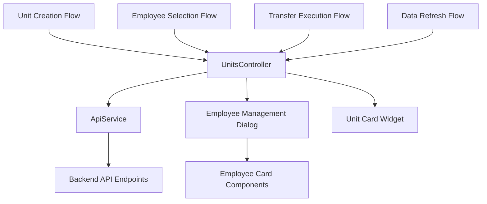
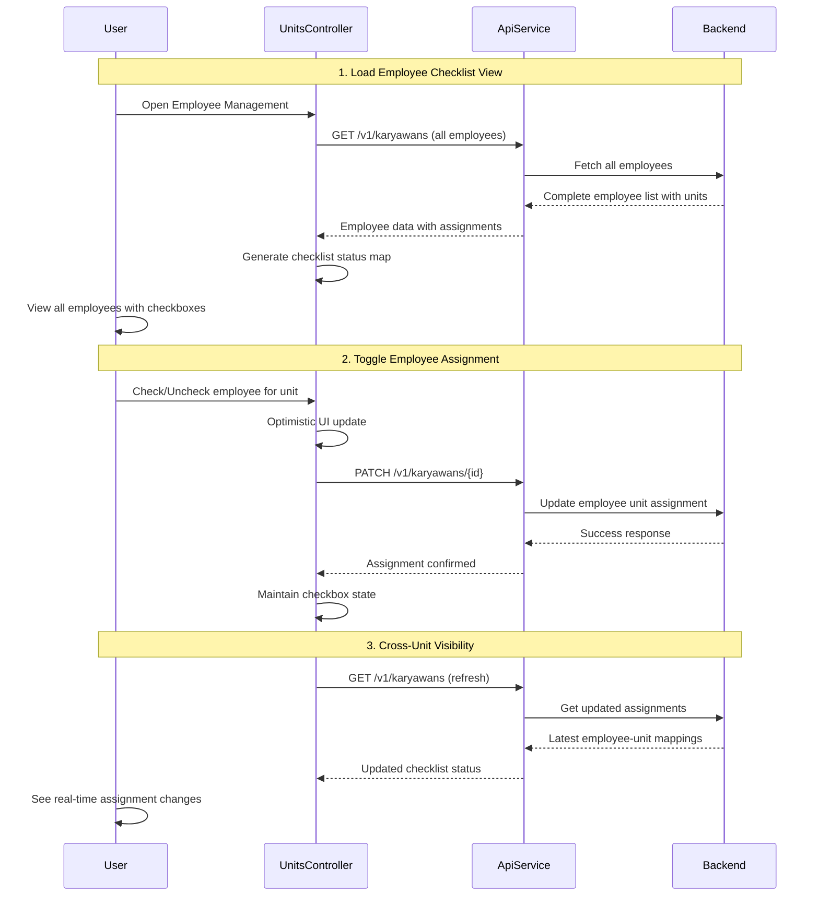

# Unit Transfer Workflow Fix - Employee Transfer Between Units

## Overview

This design document outlines the fix for the unit transfer workflow that enables moving employees (karyawan) between units via API without requiring backend changes. The current implementation has placeholder methods that need to be replaced with proper API integration following the specified workflow pattern.

## Technology Stack & Dependencies

- **Framework**: Flutter Web with GetX state management
- **Architecture**: MVC pattern with GetX controllers
- **HTTP Client**: GetConnect for API communication
- **State Management**: GetX reactive programming
- **UI Components**: Material Design with custom widgets

## Component Architecture

### Affected Components



### Component Hierarchy

```
UnitsView
├── UnitCard (per unit)
│   └── Employee Management Button
└── EmployeeManagementDialog
    ├── Available Employees List
    │   └── EmployeeCard (with Add action)
    ├── Assigned Employees List
    │   └── EmployeeCard (with Remove action)
    └── Action Buttons
```

### Current State Management Issues

**Problem Areas:**
- `assignEmployeeToUnit()` - Uses local state only, no API call
- `removeEmployeeFromUnit()` - Uses local state only, no API call  
- `loadEmployeesForUnit()` - Loads all users instead of unit-specific karyawan
- Missing refresh mechanism after transfers
- No visual indicator for employee-unit assignments across all units

**Enhanced State Management Requirements:**
- **Checklist Status Tracking** - Map of employee assignments per unit
- **Global Employee View** - All employees visible with their unit indicators
- **Real-time Updates** - Immediate UI feedback on assignment changes
- **Cross-Unit Visibility** - See employee assignments across all units

## API Integration Layer

### Required API Endpoints

| Method | Endpoint | Purpose | Request Body |
|--------|----------|---------|--------------|
| POST | `/v1/units` | Create new unit | `{nama_unit, kategori_unit, description}` |
| GET | `/v1/karyawans?id_unit={id}` | Get employees by unit | Query parameter |
| PATCH | `/v1/karyawans/{id}` | Update employee unit | `{id_unit: newUnitId}` |
| GET | `/v1/karyawans` | Get all employees | Optional query filters |

### API Service Updates

**New Method Required:**
```dart
Future<Response> getKaryawansByUnit(int unitId) async {
  return get('/karyawans', query: {'id_unit': unitId.toString()});
}
```

**Existing Methods to Use:**
- `updateKaryawan(int karyawanId, Map<String, dynamic> data)` - Already implemented
- `getKaryawans({Map<String, String>? query})` - Already implemented

## Business Logic Layer

### Transfer Workflow Architecture



### Controller Method Updates

**loadAllKaryawansWithUnitStatus() - Enhanced Implementation:**
```dart
Future<void> loadAllKaryawansWithUnitStatus(int currentUnitId) async {
  try {
    isLoadingEmployees.value = true;
    
    // Load all employees
    final allEmployeesResponse = await apiService.getKaryawans();
    
    if (allEmployeesResponse.isOk && allEmployeesResponse.body['success'] == true) {
      final data = allEmployeesResponse.body['data'] ?? [];
      final allKaryawans = data.map((item) => Karyawan.fromJson(item)).toList();
      
      // Create checklist status map
      employeeChecklistStatus.value = Map.fromIterable(
        allKaryawans,
        key: (karyawan) => karyawan.id,
        value: (karyawan) => karyawan.idUnit == currentUnitId,
      );
      
      // Store all employees for display
      allEmployeesForChecklist.value = allKaryawans;
    }
  } catch (e) {
    handleError(e, context: 'loadAllKaryawansWithUnitStatus');
  } finally {
    isLoadingEmployees.value = false;
  }
}
```

**toggleEmployeeUnitAssignment() - Checklist Implementation:**
```dart
Future<void> toggleEmployeeUnitAssignment(int karyawanId, int unitId, bool shouldAssign) async {
  try {
    // Optimistic update for immediate UI feedback
    employeeChecklistStatus[karyawanId] = shouldAssign;
    
    final transferData = {
      'id_unit': shouldAssign ? unitId : 0 // 0 means unassigned
    };
    
    final response = await apiService.updateKaryawan(karyawanId, transferData);
    
    if (response.isOk && response.body['success'] == true) {
      // Update employee data in local list
      final employeeIndex = allEmployeesForChecklist.indexWhere(
        (emp) => emp.id == karyawanId
      );
      
      if (employeeIndex != -1) {
        final updatedEmployee = allEmployeesForChecklist[employeeIndex].copyWith(
          idUnit: shouldAssign ? unitId : 0
        );
        allEmployeesForChecklist[employeeIndex] = updatedEmployee;
      }
      
      AppSnackbar.success(shouldAssign 
        ? 'Karyawan berhasil ditugaskan ke unit'
        : 'Karyawan berhasil dikeluarkan dari unit');
        
      // Refresh global karyawan list
      await loadKaryawans();
    } else {
      // Revert optimistic update on failure
      employeeChecklistStatus[karyawanId] = !shouldAssign;
      throw Exception(response.body['message'] ?? 'Gagal mengubah penugasan');
    }
  } catch (e) {
    // Revert optimistic update on error
    employeeChecklistStatus[karyawanId] = !shouldAssign;
    StandardErrorHandler.handleUpdateError('penugasan karyawan', e);
  }
}
```

**transferEmployeeToUnit() - Fixed Implementation:**
```dart
Future<void> transferEmployeeToUnit(int karyawanId, int targetUnitId) async {
  try {
    isLoading.value = true;
    AppSnackbar.updateLoading('transfer karyawan');
    
    final transferData = {'id_unit': targetUnitId};
    
    final response = await apiService.updateKaryawan(karyawanId, transferData);
    
    if (response.isOk && response.body['success'] == true) {
      AppSnackbar.updateSuccess('transfer karyawan');
      
      // Refresh both source and target unit data
      await refreshUnitsData();
      
      // Auto-refresh current dialog if open
      if (selectedUnitForAssignment.value > 0) {
        await loadKaryawansByUnit(selectedUnitForAssignment.value);
      }
    } else {
      throw Exception(response.body['message'] ?? 'Transfer gagal');
    }
  } catch (e) {
    StandardErrorHandler.handleUpdateError('transfer karyawan', e);
  } finally {
    isLoading.value = false;
  }
}
```

### Data Flow Enhancements

**Reactive State Updates:**
1. **Immediate UI Feedback** - Checkbox state changes instantly
2. **Optimistic Updates** - Update checklist before API confirmation
3. **Automatic Refresh** - Sync all unit views after changes
4. **Error Handling** - Revert checkbox state on API failure
5. **Cross-Unit Sync** - Update employee status across all units

**Checklist State Synchronization:**
```dart
// Observable state for employee checklist
var allEmployeesForChecklist = <Karyawan>[].obs;
var employeeChecklistStatus = <int, bool>{}.obs; // employeeId -> isAssigned
var showOnlyUnassigned = false.obs;

// Update checklist after assignment change
void updateChecklistStatus(int employeeId, int newUnitId, int currentUnitId) {
  employeeChecklistStatus[employeeId] = (newUnitId == currentUnitId);
  
  // Update employee data in list
  final index = allEmployeesForChecklist.indexWhere((emp) => emp.id == employeeId);
  if (index != -1) {
    allEmployeesForChecklist[index] = allEmployeesForChecklist[index].copyWith(idUnit: newUnitId);
  }
}
```

## UI Architecture & Navigation

### Employee Checklist System

**Visual Design:**
```
┌─────────────────────────────────────────────────────────────┐
│                  Kelola Karyawan - Unit IT                 │
├─────────────────────────────────────────────────────────────┤
│ Filter: [Show All ▼] [✓ Show only unassigned]             │
├─────────────────────────────────────────────────────────────┤
│ ☑ Ahmad Fauzi        | Unit IT      | NIK: 123456         │
│ ☐ Siti Nurhaliza     | Unit Finance | NIK: 789012         │
│ ☑ Budi Santoso       | Unit IT      | NIK: 345678         │
│ ☐ [Unassigned]       | -            | NIK: 901234         │
└─────────────────────────────────────────────────────────────┘
```

**Checklist Functionality:**
- **✓ Checked** - Employee is assigned to current unit
- **☐ Unchecked** - Employee is in different unit or unassigned
- **Unit Label** - Shows current unit assignment
- **Instant Toggle** - Click checkbox to assign/unassign
- **Batch Operations** - Select multiple employees for bulk transfer

**Interactive Elements:**
1. **Unit Filter Dropdown** - Switch between units to manage
2. **Show Unassigned Toggle** - Filter to see only unassigned employees
3. **Employee Checkboxes** - Direct assignment control
4. **Unit Indicators** - Visual tags showing current assignments
5. **Search/Filter** - Find employees by name or NIK

### Employee Management Dialog Enhancements

**Visual Checklist System:**
- **Checkbox Indicators**: Each employee shows a checkbox indicating unit assignment
- **Multi-Unit View**: Display all employees with their current unit assignments
- **Visual Differentiation**: Checked employees belong to current unit, unchecked are from other units
- **Real-time Updates**: Checkbox states update immediately after transfers

**Layout Improvements:**
- **Single Employee List**: All employees in one scrollable list with unit indicators
- **Checkbox Column**: Visual checkmarks showing unit membership
- **Unit Labels**: Display current unit assignment for each employee
- **Filter Options**: Toggle to show all employees or only unassigned ones

**User Experience Flow:**
1. **View All Employees** - See complete employee list with unit indicators
2. **Check/Uncheck Assignment** - Toggle employee assignment to current unit
3. **Visual Confirmation** - Immediate checkbox state change
4. **Bulk Operations** - Select multiple employees for batch transfer
5. **Auto-refresh** - Automatic synchronization across all units

**Enhanced Widget Architecture Updates**

**EmployeeChecklistCard Component:**
```dart
class EmployeeChecklistCard extends StatelessWidget {
  final Karyawan employee;
  final bool isAssignedToCurrentUnit;
  final VoidCallback? onToggleAssignment;
  final bool isLoading;
  final Unit? currentUnit;

  Widget build(BuildContext context) {
    return Card(
      child: ListTile(
        leading: Checkbox(
          value: isAssignedToCurrentUnit,
          onChanged: isLoading ? null : (_) => onToggleAssignment?.call(),
        ),
        title: Text(employee.nama),
        subtitle: Row([
          Icon(Icons.business, size: 16),
          Text(employee.unit?.nama ?? 'Unassigned'),
          SizedBox(width: 16),
          Icon(Icons.badge, size: 16),
          Text('NIK: ${employee.nik}'),
        ]),
        trailing: isLoading 
          ? CircularProgressIndicator()
          : UnitAssignmentBadge(unit: employee.unit),
      ),
    );
  }
}
```

**Unit Assignment Badge:**
```dart
class UnitAssignmentBadge extends StatelessWidget {
  final Unit? unit;
  final bool isHighlighted;
  
  Widget build(BuildContext context) {
    if (unit == null) {
      return Chip(
        label: Text('Unassigned'),
        backgroundColor: Colors.grey[200],
      );
    }
    
    return Chip(
      label: Text(unit!.nama),
      backgroundColor: isHighlighted ? Colors.blue[100] : Colors.green[100],
      avatar: Icon(Icons.business, size: 16),
    );
  }
}
```

**Filter and Control Panel:**
```dart
class EmployeeFilterPanel extends StatelessWidget {
  final List<Unit> units;
  final int? selectedUnitId;
  final bool showOnlyUnassigned;
  final Function(int?) onUnitChanged;
  final Function(bool) onUnassignedToggle;
  
  Widget build(BuildContext context) {
    return Card(
      child: Padding(
        padding: EdgeInsets.all(16),
        child: Row([
          DropdownButton<int?>(
            value: selectedUnitId,
            hint: Text('Select Unit to Manage'),
            items: units.map((unit) => DropdownMenuItem(
              value: unit.id,
              child: Text(unit.nama),
            )).toList(),
            onChanged: onUnitChanged,
          ),
          SizedBox(width: 16),
          FilterChip(
            label: Text('Show only unassigned'),
            selected: showOnlyUnassigned,
            onSelected: onUnassignedToggle,
          ),
        ]),
      ),
    );
  }
}
```

## Testing Strategy

### Unit Testing

**Controller Tests:**
```dart
group('UnitsController Checklist Tests', () {
  test('should load all employees with checklist status', () async {
    // Mock API responses
    when(mockApiService.getKaryawans())
        .thenAnswer((_) async => Response(body: mockEmployeeData));
    
    await controller.loadAllKaryawansWithUnitStatus(1);
    
    expect(controller.allEmployeesForChecklist.length, equals(3));
    expect(controller.employeeChecklistStatus[1], equals(true));  // In unit 1
    expect(controller.employeeChecklistStatus[2], equals(false)); // In unit 2
  });
  
  test('should toggle employee assignment with optimistic update', () async {
    // Setup initial state
    controller.employeeChecklistStatus[1] = false;
    
    // Mock successful API response
    when(mockApiService.updateKaryawan(1, {'id_unit': 1}))
        .thenAnswer((_) async => Response(body: {'success': true}));
    
    await controller.toggleEmployeeUnitAssignment(1, 1, true);
    
    expect(controller.employeeChecklistStatus[1], equals(true));
  });
  
  test('should revert optimistic update on API failure', () async {
    // Setup initial state
    controller.employeeChecklistStatus[1] = false;
    
    // Mock API failure
    when(mockApiService.updateKaryawan(1, {'id_unit': 1}))
        .thenAnswer((_) async => Response(statusCode: 500));
    
    await controller.toggleEmployeeUnitAssignment(1, 1, true);
    
    expect(controller.employeeChecklistStatus[1], equals(false)); // Reverted
  });
});
```

**API Service Tests:**
```dart
group('ApiService Karyawan Tests', () {
  test('should get karyawans by unit ID', () async {
    // Test query parameter handling
    // Verify response parsing
  });
  
  test('should update karyawan unit assignment', () async {
    // Test PATCH request
    // Verify request body format
  });
});
```

### Integration Testing

**Transfer Workflow Tests:**
1. **End-to-End Transfer** - Complete workflow from unit creation to employee transfer
2. **Multi-Unit Transfers** - Moving employees between multiple units
3. **Error Recovery** - Network failures and API errors
4. **State Consistency** - UI state matches backend data

### Widget Testing

**Employee Checklist Dialog:**
```dart
testWidgets('should display employees with correct checkbox states', (tester) async {
  // Setup mock data
  final mockEmployees = [
    Karyawan(id: 1, nama: 'John', idUnit: 1), // In current unit
    Karyawan(id: 2, nama: 'Jane', idUnit: 2), // In different unit
  ];
  
  await tester.pumpWidget(EmployeeManagementDialog(
    unit: Unit(id: 1, nama: 'IT'),
    employees: mockEmployees,
  ));
  
  // Verify checkbox states
  expect(find.byType(Checkbox), findsNWidgets(2));
  
  final checkbox1 = tester.widget<Checkbox>(find.byKey(Key('checkbox_1')));
  final checkbox2 = tester.widget<Checkbox>(find.byKey(Key('checkbox_2')));
  
  expect(checkbox1.value, equals(true));  // John is in unit 1
  expect(checkbox2.value, equals(false)); // Jane is in unit 2
});

testWidgets('should toggle employee assignment on checkbox tap', (tester) async {
  final controller = Get.put(UnitsController());
  
  await tester.pumpWidget(EmployeeChecklistCard(
    employee: Karyawan(id: 1, nama: 'John', idUnit: 2),
    isAssignedToCurrentUnit: false,
    onToggleAssignment: () => controller.toggleEmployeeUnitAssignment(1, 1, true),
  ));
  
  // Tap checkbox
  await tester.tap(find.byType(Checkbox));
  await tester.pump();
  
  // Verify assignment was called
  verify(controller.toggleEmployeeUnitAssignment(1, 1, true)).called(1);
});
```

## Implementation Phases

### Phase 1: Checklist State Management
- [ ] Add checklist observable states to UnitsController
- [ ] Implement `loadAllKaryawansWithUnitStatus()` method
- [ ] Create `toggleEmployeeUnitAssignment()` method
- [ ] Add optimistic update with error recovery

### Phase 2: Checklist UI Components
- [ ] Build EmployeeChecklistCard with checkbox
- [ ] Create UnitAssignmentBadge component
- [ ] Implement EmployeeFilterPanel
- [ ] Add unit selection and filter controls

### Phase 3: Enhanced Employee Management Dialog
- [ ] Replace dual-panel layout with single checklist view
- [ ] Integrate filter controls for unassigned employees
- [ ] Add batch selection capabilities
- [ ] Implement real-time checkbox state updates

### Phase 4: Cross-Unit Visibility
- [ ] Add global employee view across all units
- [ ] Implement unit-specific filtering
- [ ] Add visual indicators for employee assignments
- [ ] Enable quick unit switching in management dialog

### Phase 5: Testing & Polish
- [ ] Write comprehensive checklist state tests
- [ ] Add widget tests for checkbox interactions
- [ ] Test cross-unit visibility and filtering
- [ ] Performance optimization for large employee lists

## Success Criteria

1. **Functional Requirements**
   - ✅ Create new units successfully
   - ✅ Filter employees by unit ID  
   - ✅ Transfer employees between units via API
   - ✅ Automatic data refresh after transfers

2. **Technical Requirements**
   - ✅ No backend API changes required
   - ✅ Proper error handling and recovery
   - ✅ Reactive state management
   - ✅ Comprehensive test coverage

3. **User Experience**
   - ✅ Intuitive checklist-based assignment workflow
   - ✅ Visual checkbox indicators for all employees
   - ✅ Cross-unit visibility and management
   - ✅ Real-time assignment status updates
   - ✅ Filter controls for efficient employee management