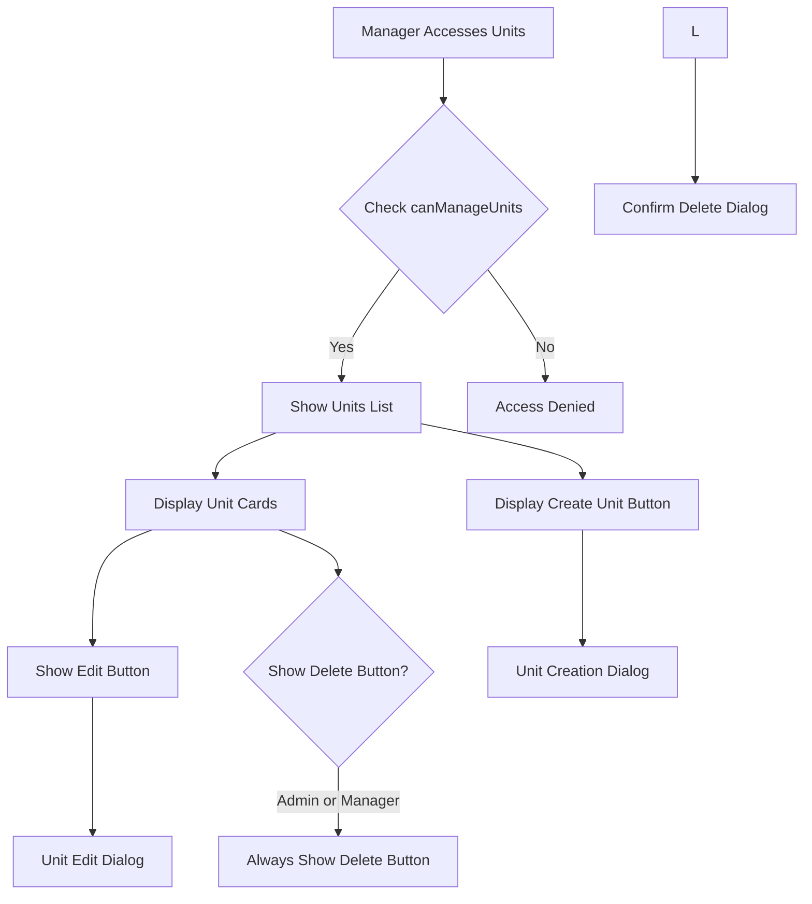
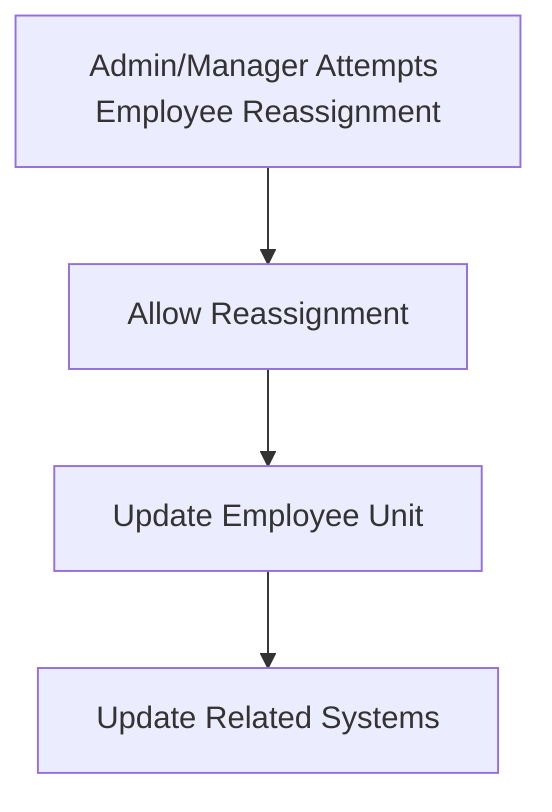

# Unit Management Access for Manager Role

## Overview

This design document clarifies and defines the unit management permissions and capabilities for the Manager role in the helpdek Flutter web application. The current implementation shows that managers have partial access to unit operations, and this document outlines the complete scope of unit-related permissions for managers.

## Current Implementation Analysis

Based on the existing codebase analysis, the current role-based permissions for units are:

- **Administrator**: Full access to unit management (create, read, update, delete)
- **Manager**: Full access to unit management (same as Administrator)
- **Other roles**: No direct unit management access

## Technology Stack & Dependencies

- **Flutter Web** with GetX state management
- **Role-based access control** using User model role checking methods
- **API Service** integration for unit operations
- **Reactive UI** using Obx widgets and observable variables

## Enhanced Unit Management Access for Manager Role

### Permission Matrix

| Operation | Administrator | Manager | Karyawan | User/Klien |
|-----------|---------------|---------|----------|------------|
| View Units List | ✅ | ✅ | ❌ | ❌ |
| Create Unit | ✅ | ✅ | ❌ | ❌ |
| Update Unit | ✅ | ✅ | ❌ | ❌ |
| Delete Unit | ✅ | ✅ | ❌ | ❌ |
| Assign Employees to Units | ✅ | ✅ | ❌ | ❌ |
| Remove Employees from Units | ✅ | ✅ | ❌ | ❌ |
| View Unit Employees | ✅ | ✅ | ❌ | ❌ |
| Access Unit Management Dialog | ✅ | ✅ | ❌ | ❌ |

### Identical Access for Manager and Admin

Both Manager and Administrator roles have identical permissions for unit management:

1. **Full Unit CRUD Operations**: Both can create, read, update, and delete units without restrictions
2. **Complete Employee Management**: Both can assign/reassign employees to any unit
3. **Unrestricted Access**: No role-based limitations between Manager and Admin for unit operations

## Updated Permission Methods

### UnitsController Enhancements

```dart
class UnitsController extends BaseController {
  // Enhanced permission checking for managers
  bool get canManageUnits {
    final currentUser = authService.user;
    return currentUser?.isAdmin() == true || currentUser?.isManager() == true;
  }

  bool get canDeleteUnits {
    final currentUser = authService.user;
    // Both Admin and Manager have full delete access
    return currentUser?.isAdmin() == true || currentUser?.isManager() == true;
  }

  // Employee assignment - no restrictions for Admin or Manager
  bool canAssignEmployeeToUnit(Karyawan employee, Unit targetUnit) {
    final currentUser = authService.user;
    // Both Admin and Manager have full access
    return currentUser?.isAdmin() == true || currentUser?.isManager() == true;
  }
}
```

## Navigation and UI Access

### Main Layout Navigation

The manager role should have access to the Units navigation item:

```dart
// Admin and Manager shared menus
if (user.isAdmin() || user.isManager()) {
  items.addAll([
    const NavigationItem(
      icon: Icons.business_outlined,
      selectedIcon: Icons.business,
      label: 'Units',
      route: '/units',
      roles: ['Administrator', 'Manager'],
    ),
  ]);
}

// Manager specific menus
if (user.isManager()) {
  items.addAll([
    const NavigationItem(
      icon: Icons.confirmation_number_outlined,
      selectedIcon: Icons.confirmation_number,
      label: 'Tiket',
      route: '/tikets',
      roles: ['Manager'],
    ),
  ]);
}
```

### Units View Access Control

The UnitsView should be accessible to managers with appropriate UI elements:



## Employee Management Workflow

### Manager Capabilities in Employee Assignment

1. **View All Employees**: Managers can see all employees across units
2. **Reassign Employees**: Can move employees between units with validation
3. **Bulk Operations**: Can perform bulk employee assignments
4. **Filter and Search**: Access to employee filtering by unit assignment status

### Validation Rules for Admin and Manager Roles



## API Integration Updates

### API Integration

The existing API service already supports full unit management operations for both Admin and Manager roles:

1. **Standard CRUD Operations**: Full create, read, update, delete access
2. **Employee Management**: Complete employee assignment capabilities
3. **Unit Statistics**: Access to unit performance metrics

No additional validation endpoints are required since both roles have identical access.

## Testing Strategy

### Unit Tests for Manager Permissions

1. **Permission Validation Tests**
   - Test `canManageUnits` returns true for both admin and manager roles
   - Test `canDeleteUnits` returns true for both admin and manager roles
   - Verify identical functionality between admin and manager roles

2. **UI Access Tests**
   - Verify manager can access Units navigation
   - Confirm appropriate buttons are visible/hidden
   - Test dialog access and functionality

3. **Employee Management Tests**
   - Test employee reassignment validation
   - Verify bulk operation permissions
   - Test filter and search functionality

### Integration Tests

1. **End-to-End Unit Management Flow**
   - Manager creates new unit
   - Assigns employees to unit
   - Attempts to delete unit with/without employees
   - Validates API responses and UI updates

2. **Role-Based Access Validation**
   - Test that manager and admin have identical permissions
   - Verify proper error handling for unauthorized actions from other roles
   - Test session-based permission updates for both admin and manager