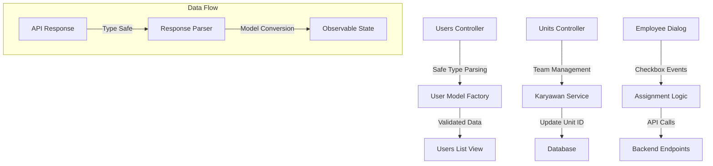
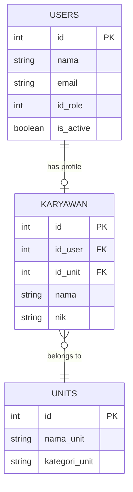
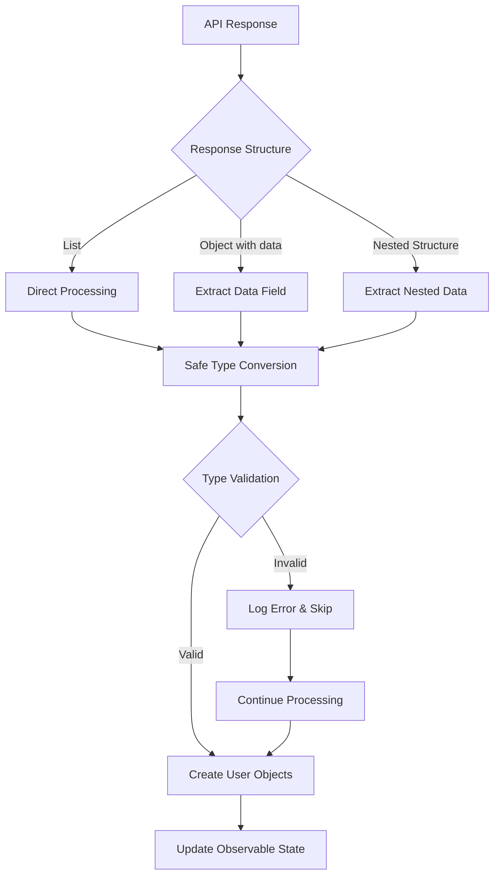
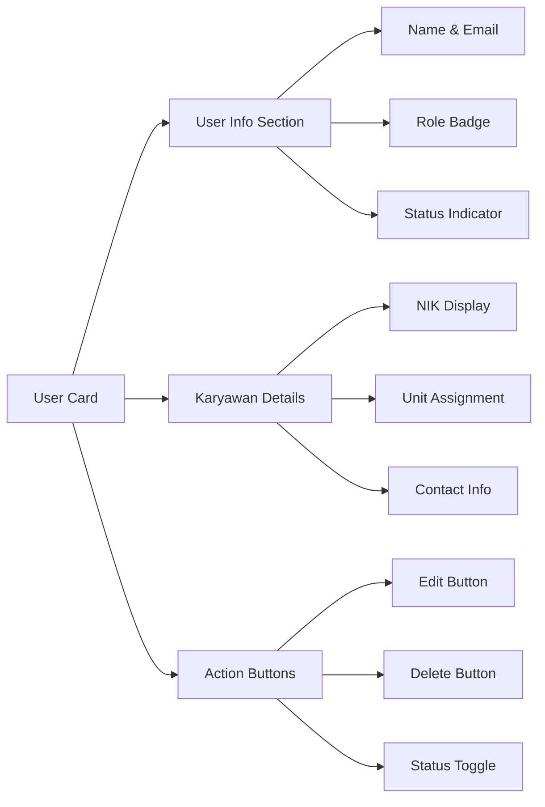
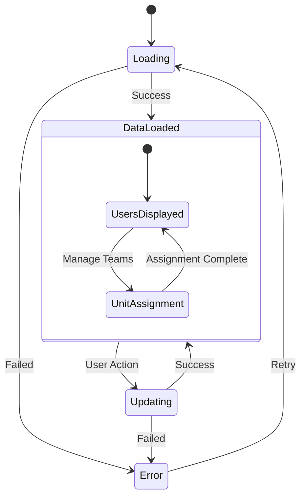
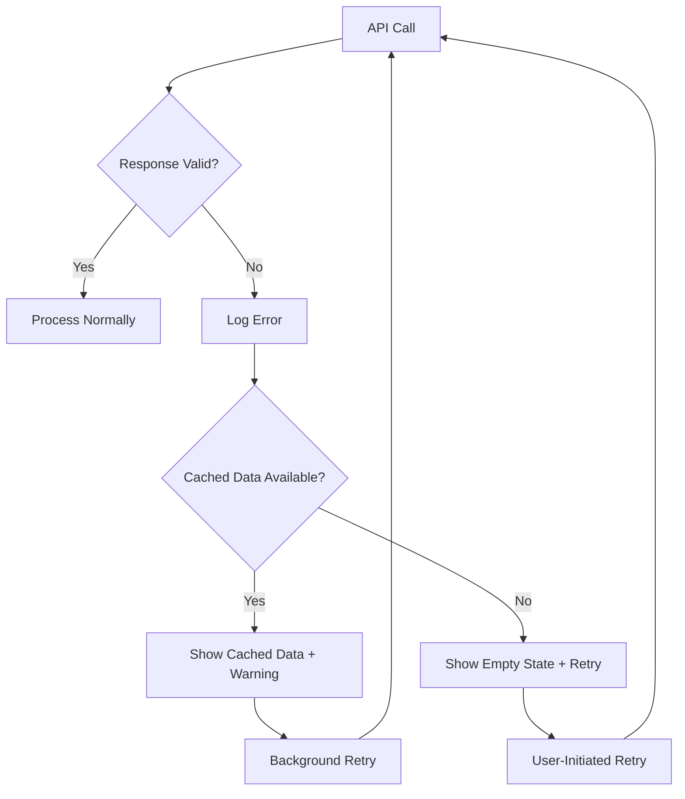
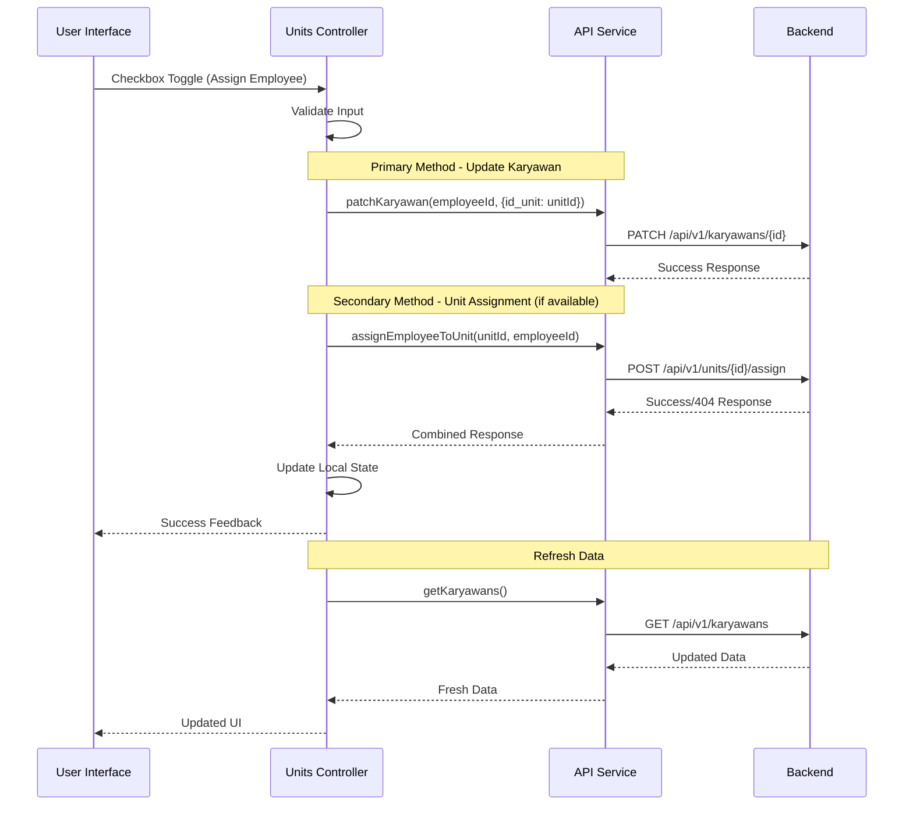
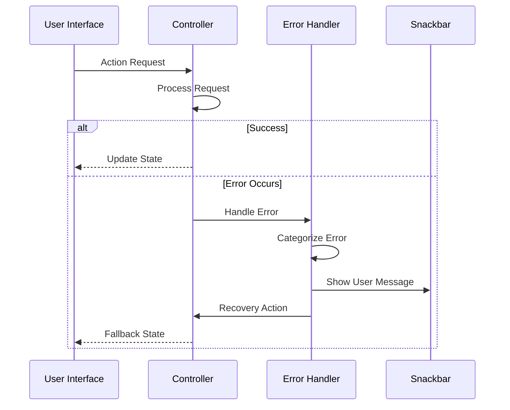

# User Management Fix Design

## Overview

This design addresses critical issues in the user management system including:
1. **TypeError** with minified types causing users list not to display
2. **Team assignment functionality** for employee-unit relationships
3. **User-friendly checkboxes** for unit management in employee profiles

## Architecture

### Problem Analysis

#### 1. Users List Error
- **Error**: `TypeError: Instance of 'minified:m7': type 'minified:m7' is not a subtype of type 'minified:fl'`
- **Root Cause**: Type casting issues in Flutter web compilation when parsing API responses
- **Impact**: Users list fails to load, displaying empty state instead of user data

#### 2. Team Assignment Issues  
- **Current State**: Unit assignment exists but lacks proper API integration
- **Missing Feature**: Real-time unit assignment/unassignment with checkbox interface
- **User Experience**: No visual feedback for team membership changes

### Solution Architecture



## Data Models & Type Safety

### Enhanced Type Parsing

```dart
// User Model Safe Parsing
factory User.fromJson(Map<String, dynamic> json) {
  return User(
    id: _parseIntSafe(json["id"]),
    nama: _parseStringSafe(json["nama"]),
    email: _parseStringSafe(json["email"]),
    idRole: _parseIntNullable(json["id_role"]),
    isActive: _parseIsActiveSafe(json),
    // ... other fields with safe parsing
  );
}

static int _parseIntSafe(dynamic value) {
  if (value == null) return 0;
  if (value is int) return value;
  if (value is String) return int.tryParse(value) ?? 0;
  if (value is double) return value.toInt();
  return 0;
}
```

### Karyawan-Unit Relationship



## API Integration Layer

### Complete Backend API Routes

#### User Management Routes
| Endpoint | Method | Purpose | Parameters |
|----------|--------|---------|------------|
| `GET /api/v1/users` | GET | Get users list with pagination | `?page=1&per_page=15&search=query&role_id=3&is_active=1` |
| `POST /api/v1/users` | POST | Create new user | Body: user data |
| `PUT /api/v1/users/{id}` | PUT | Update user data | Body: updated user data |
| `DELETE /api/v1/users/{id}` | DELETE | Delete user | - |
| `GET /api/v1/users/{id}` | GET | Get single user details | - |

#### Karyawan Management Routes
| Endpoint | Method | Purpose | Parameters |
|----------|--------|---------|------------|
| `GET /api/v1/karyawans` | GET | Get all karyawan data | `?user_id=5` (optional filter) |
| `POST /api/v1/karyawans` | POST | Create karyawan profile | Body: karyawan data |
| `PUT /api/v1/karyawans/{id}` | PUT | Update karyawan data | Body: updated karyawan data |
| `PATCH /api/v1/karyawans/{id}` | PATCH | Update specific karyawan fields | Body: `{"id_unit": 3}` |
| `DELETE /api/v1/karyawans/{id}` | DELETE | Delete karyawan profile | - |
| `GET /api/v1/karyawans/{id}` | GET | Get single karyawan details | - |

#### Unit Management Routes
| Endpoint | Method | Purpose | Parameters |
|----------|--------|---------|------------|
| `GET /api/v1/units` | GET | Get all units | - |
| `POST /api/v1/units` | POST | Create new unit | Body: unit data |
| `PUT /api/v1/units/{id}` | PUT | Update unit data | Body: updated unit data |
| `DELETE /api/v1/units/{id}` | DELETE | Delete unit | - |
| `GET /api/v1/units/{id}` | GET | Get single unit details | - |
| `GET /api/v1/units/{id}/employees` | GET | Get employees in unit | - |
| `POST /api/v1/units/{id}/assign` | POST | Assign employee to unit | Body: `{"employee_id": 5}` |
| `DELETE /api/v1/units/{id}/unassign/{employeeId}` | DELETE | Remove employee from unit | - |

#### Role Management Routes
| Endpoint | Method | Purpose | Parameters |
|----------|--------|---------|------------|
| `GET /api/v1/roles` | GET | Get all roles | - |
| `GET /api/v1/roles/options` | GET | Get role options for forms | - |

### Request/Response Schema

#### User Creation/Update
```json
// POST /api/v1/users - Create User
{
  "nama": "John Doe",
  "email": "john@example.com",
  "password": "securepassword",
  "password_confirmation": "securepassword",
  "id_role": 3,
  "isActive": true
}

// Response
{
  "success": true,
  "message": "User berhasil dibuat",
  "data": {
    "id": 5,
    "nama": "John Doe",
    "email": "john@example.com",
    "id_role": 3,
    "isActive": true,
    "created_at": "2024-01-15T10:00:00Z",
    "updated_at": "2024-01-15T10:00:00Z"
  }
}
```

#### Karyawan Unit Assignment
```json
// PATCH /api/v1/karyawans/{id} - Update Unit Assignment
{
  "id_unit": 3
}

// Response
{
  "success": true,
  "message": "Karyawan berhasil dipindahkan ke unit",
  "data": {
    "id": 1,
    "id_user": 5,
    "id_unit": 3,
    "nama": "John Doe",
    "nik": "123456789",
    "unit": {
      "id": 3,
      "nama_unit": "IT Support",
      "kategori_unit": "Technical"
    }
  }
}
```

#### Users List with Pagination
```json
// GET /api/v1/users?page=1&per_page=15&role_id=3
// Response
{
  "success": true,
  "data": {
    "data": [
      {
        "id": 1,
        "nama": "Admin User",
        "email": "admin@example.com",
        "id_role": 1,
        "isActive": true,
        "role": {
          "id": 1,
          "nama_role": "Administrator"
        }
      }
    ],
    "current_page": 1,
    "last_page": 3,
    "per_page": 15,
    "total": 45
  }
}
```

#### Unit Employee Assignment
```json
// POST /api/v1/units/{id}/assign - Assign Employee to Unit
{
  "employee_id": 5
}

// Response
{
  "success": true,
  "message": "Karyawan berhasil ditugaskan ke unit",
  "data": {
    "unit_id": 2,
    "employee_id": 5,
    "assigned_at": "2024-01-15T10:00:00Z"
  }
}
```

### Frontend API Service Implementation

```dart
class ApiService extends GetConnect {
  @override
  void onInit() {
    super.onInit();
    httpClient.baseUrl = 'http://backend.test/api/v1';
    httpClient.defaultContentType = "application/json";
    httpClient.timeout = const Duration(seconds: 10);
  }

  // User Management APIs
  Future<Response> getUsers({Map<String, String>? query}) async {
    return get('/users', query: query);
  }

  Future<Response> createUser(Map<String, dynamic> userData) async {
    return post('/users', userData);
  }

  Future<Response> updateUser(int userId, Map<String, dynamic> userData) async {
    return put('/users/$userId', userData);
  }

  Future<Response> deleteUser(int userId) async {
    return delete('/users/$userId');
  }

  Future<Response> getUserById(int userId) async {
    return get('/users/$userId');
  }

  // Karyawan Management APIs
  Future<Response> getKaryawans({Map<String, String>? query}) async {
    return get('/karyawans', query: query);
  }

  Future<Response> createKaryawan(Map<String, dynamic> karyawanData) async {
    return post('/karyawans', karyawanData);
  }

  Future<Response> updateKaryawan(int karyawanId, Map<String, dynamic> karyawanData) async {
    return put('/karyawans/$karyawanId', karyawanData);
  }

  Future<Response> patchKaryawan(int karyawanId, Map<String, dynamic> data) async {
    return patch('/karyawans/$karyawanId', data);
  }

  Future<Response> deleteKaryawan(int karyawanId) async {
    return delete('/karyawans/$karyawanId');
  }

  // Unit Management APIs
  Future<Response> getUnits({Map<String, String>? query}) async {
    return get('/units', query: query);
  }

  Future<Response> createUnit(Map<String, dynamic> unitData) async {
    return post('/units', unitData);
  }

  Future<Response> updateUnit(int unitId, Map<String, dynamic> unitData) async {
    return put('/units/$unitId', unitData);
  }

  Future<Response> deleteUnit(int unitId) async {
    return delete('/units/$unitId');
  }

  Future<Response> getUnitEmployees(int unitId) async {
    return get('/units/$unitId/employees');
  }

  Future<Response> assignEmployeeToUnit(int unitId, int employeeId) async {
    return post('/units/$unitId/assign', {'employee_id': employeeId});
  }

  Future<Response> removeEmployeeFromUnit(int unitId, int employeeId) async {
    return delete('/units/$unitId/unassign/$employeeId');
  }

  // Role Management APIs
  Future<Response> getRoles({Map<String, String>? query}) async {
    return get('/roles', query: query);
  }

  Future<Response> getRoleOptions() async {
    return get('/roles/options');
  }
}
```

## Business Logic Layer

### UsersController Enhancements

#### Type-Safe Response Processing



#### Error Handling Strategy

```dart
void _processUsersResponse(dynamic responseBody, bool refresh) {
  try {
    dynamic data = _extractDataSafely(responseBody);
    
    if (data is! Iterable) {
      throw TypeException('Invalid data format: expected Iterable, got ${data.runtimeType}');
    }
    
    final List<User> newUsers = [];
    for (var item in data) {
      try {
        if (item is Map<String, dynamic>) {
          final user = User.fromJson(item);
          newUsers.add(user);
        }
      } catch (e) {
        debugPrint('Skipping invalid user data: $e');
        continue; // Skip invalid entries instead of failing
      }
    }
    
    _updateUsersList(newUsers, refresh);
  } catch (e) {
    _handleProcessingError(e);
  }
}
```

### UnitsController Team Management

### Enhanced Assignment Logic with Proper API Routes

```dart
// Enhanced assignment with proper API integration
Future<void> assignEmployeeToUnit(String unitId, String employeeId) async {
  try {
    isLoading.value = true;
    AppSnackbar.updateLoading('penugasan karyawan');
    
    // Method 1: Update karyawan unit directly (recommended)
    final karyawanResponse = await apiService.patchKaryawan(
      int.parse(employeeId), 
      {'id_unit': int.parse(unitId)}
    );
    
    if (karyawanResponse.isOk && karyawanResponse.body['success'] == true) {
      // Method 2: Also call unit assignment endpoint if available
      try {
        await apiService.assignEmployeeToUnit(
          int.parse(unitId), 
          int.parse(employeeId)
        );
      } catch (e) {
        debugPrint('Unit assignment endpoint not available: $e');
        // Continue with karyawan update only
      }
      
      // Update local state
      await _updateLocalUnitAssignment(employeeId, unitId);
      
      AppSnackbar.success('Karyawan berhasil ditugaskan ke unit');
      
      // Refresh data to ensure consistency
      await Future.wait([
        loadKaryawans(),
        loadEmployeesForUnit(unitId),
      ]);
    } else {
      throw Exception(karyawanResponse.body['message'] ?? 'Gagal menugaskan karyawan');
    }
  } catch (e) {
    StandardErrorHandler.handleUpdateError('penugasan karyawan', e);
  } finally {
    isLoading.value = false;
  }
}

Future<void> removeEmployeeFromUnit(String unitId, String employeeId) async {
  try {
    isLoading.value = true;
    AppSnackbar.updateLoading('penghapusan penugasan');
    
    // Method 1: Remove unit assignment by setting to 0 or null
    final karyawanResponse = await apiService.patchKaryawan(
      int.parse(employeeId), 
      {'id_unit': 0} // Set to 0 to indicate no unit assignment
    );
    
    if (karyawanResponse.isOk && karyawanResponse.body['success'] == true) {
      // Method 2: Also call unit removal endpoint if available
      try {
        await apiService.removeEmployeeFromUnit(
          int.parse(unitId), 
          int.parse(employeeId)
        );
      } catch (e) {
        debugPrint('Unit removal endpoint not available: $e');
        // Continue with karyawan update only
      }
      
      // Update local state
      unitEmployees.remove(employeeId);
      
      AppSnackbar.success('Karyawan berhasil dihapus dari unit');
      
      // Refresh data
      await Future.wait([
        loadKaryawans(),
        loadEmployeesForUnit(unitId),
      ]);
    } else {
      throw Exception(karyawanResponse.body['message'] ?? 'Gagal menghapus penugasan');
    }
  } catch (e) {
    StandardErrorHandler.handleUpdateError('penghapusan penugasan', e);
  } finally {
    isLoading.value = false;
  }
}

// Load employees for unit with proper API endpoint
Future<void> loadEmployeesForUnit(String unitId) async {
  try {
    isLoadingEmployees.value = true;
    
    // Method 1: Get unit employees directly if endpoint exists
    try {
      final unitEmployeesResponse = await apiService.getUnitEmployees(int.parse(unitId));
      if (unitEmployeesResponse.isOk && unitEmployeesResponse.body['success'] == true) {
        final employeesData = unitEmployeesResponse.body['data'] ?? [];
        unitEmployees.value = (employeesData as List)
            .map((emp) => emp['id'].toString())
            .toList();
      }
    } catch (e) {
      debugPrint('Unit employees endpoint not available: $e');
      // Fallback to filtering karyawan data
      await _loadEmployeesFromKaryawanData(unitId);
    }
    
    // Load all available employees (karyawan role users)
    final usersResponse = await apiService.getUsers(query: {'role_id': '3'});
    if (usersResponse.isOk && usersResponse.body['success'] == true) {
      final data = _extractDataSafely(usersResponse.body);
      final allUsers = data.map((item) => User.fromJson(item)).toList();
      availableEmployees.value = allUsers.where((user) => user.isKaryawan()).toList();
    }
    
  } catch (e) {
    StandardErrorHandler.handleLoadError('data karyawan unit', e);
  } finally {
    isLoadingEmployees.value = false;
  }
}

// Fallback method to load employees from karyawan data
Future<void> _loadEmployeesFromKaryawanData(String unitId) async {
  final karyawanResponse = await apiService.getKaryawans();
  if (karyawanResponse.isOk && karyawanResponse.body['success'] == true) {
    final data = karyawanResponse.body['data'] ?? karyawanResponse.body;
    final List<dynamic> items = data is List ? data : (data['data'] ?? []);
    
    final unitEmployeeIds = items
        .where((item) => item['id_unit'].toString() == unitId)
        .map((item) => item['id_user'].toString())
        .toList();
    
    unitEmployees.value = unitEmployeeIds;
  }
}
```

## Component Architecture

### Enhanced User Card



### Employee Management Dialog

#### Checkbox-based Assignment Interface

```dart
Widget _buildEmployeeCheckbox(User employee, bool isAssigned) {
  return CheckboxListTile(
    title: Text(employee.nama),
    subtitle: Column(
      crossAxisAlignment: CrossAxisAlignment.start,
      children: [
        Text(employee.email),
        if (employee.isKaryawan())
          Text('NIK: ${karyawanMap[employee.id]?.nik ?? "-"}'),
      ],
    ),
    value: isAssigned,
    onChanged: (bool? value) {
      if (value == true) {
        controller.assignEmployeeToUnit(
          unit.id.toString(), 
          employee.id.toString()
        );
      } else {
        controller.removeEmployeeFromUnit(
          unit.id.toString(), 
          employee.id.toString()
        );
      }
    },
    controlAffinity: ListTileControlAffinity.trailing,
  );
}
```

## State Management

### Observable State Updates



### Reactive Data Flow

```dart
// Reactive karyawan-unit relationship
class UnitsController extends BaseController {
  var unitEmployeeMap = <int, List<Karyawan>>{}.obs;
  
  void _updateUnitEmployeeMapping() {
    unitEmployeeMap.clear();
    for (var karyawan in karyawans) {
      final unitId = karyawan.idUnit;
      if (!unitEmployeeMap.containsKey(unitId)) {
        unitEmployeeMap[unitId] = [];
      }
      unitEmployeeMap[unitId]!.add(karyawan);
    }
  }
  
  List<Karyawan> getEmployeesInUnit(int unitId) {
    return unitEmployeeMap[unitId] ?? [];
  }
}
```

## Testing Strategy

### Unit Tests for Type Safety

```dart
// Critical test cases for type parsing
group('User Model Type Safety', () {
  test('should handle minified response types', () {
    final testData = {
      'id': '123', // String ID from backend
      'nama': 'Test User',
      'email': 'test@example.com',
      'id_role': 3.0, // Double from JSON
      'isActive': '1', // String boolean
    };
    
    final user = User.fromJson(testData);
    
    expect(user.id, equals(123));
    expect(user.idRole, equals(3));
    expect(user.isActive, isTrue);
  });
  
  test('should skip invalid user entries without crashing', () {
    final mixedData = [
      {'id': 1, 'nama': 'Valid User', 'email': 'valid@test.com'},
      {'invalid': 'data'}, // Invalid entry
      {'id': 2, 'nama': 'Another Valid', 'email': 'valid2@test.com'},
    ];
    
    expect(() => processUsersList(mixedData), returnsNormally);
  });
});
```

### Integration Tests for Team Assignment

```dart
group('Team Assignment Flow', () {
  test('should assign employee to unit successfully', () async {
    // Mock API response
    when(mockApiService.updateKaryawan(any, any))
        .thenAnswer((_) async => successResponse);
    
    await controller.assignEmployeeToUnit('1', '5');
    
    verify(mockApiService.updateKaryawan(5, {'id_unit': 1}));
    expect(controller.unitEmployees, contains('5'));
  });
});
```

## Middleware & Interceptors

### Response Type Validation

```dart
class TypeSafeInterceptor extends GetMiddleware {
  @override
  GetPage? onPageBuilt(GetPage page) {
    return page.copy(
      binding: TypeSafeBinding(),
    );
  }
}

class TypeSafeBinding extends Bindings {
  @override
  void dependencies() {
    Get.put(ResponseValidator());
  }
}

class ResponseValidator {
  T validateAndConvert<T>(dynamic data, T Function(Map<String, dynamic>) fromJson) {
    if (data is! Map<String, dynamic>) {
      throw TypeException('Expected Map<String, dynamic>, got ${data.runtimeType}');
    }
    
    try {
      return fromJson(data);
    } catch (e) {
      throw TypeException('Failed to convert data: $e');
    }
  }
}
```

## Error Recovery Mechanisms

### Graceful Degradation



### Progressive Enhancement

```dart
class RobustUsersController extends BaseController {
  void _handleDataLoadFailure(dynamic error) {
    // Log error for debugging
    StandardErrorHandler.logError(error, context: 'Users Load');
    
    // Check for cached data
    if (users.isNotEmpty) {
      AppSnackbar.warning('Menggunakan data cache. Coba refresh halaman.');
      return;
    }
    
    // Show user-friendly error state
    users.clear();
    AppSnackbar.error('Gagal memuat data users. Tap untuk coba lagi.');
    
    // Schedule background retry
    Timer(Duration(seconds: 5), () {
      if (users.isEmpty) {
        loadUsers(refresh: true);
      }
    });
  }
}
```

## Performance Optimization

### Efficient Team Management

```dart
// Optimized unit-employee relationship caching
class OptimizedUnitsController extends BaseController {
  // Cache mapping for quick lookups
  final Map<int, Set<int>> _unitToEmployees = {};
  final Map<int, int> _employeeToUnit = {};
  
  void _buildRelationshipCache() {
    _unitToEmployees.clear();
    _employeeToUnit.clear();
    
    for (var karyawan in karyawans) {
      final unitId = karyawan.idUnit;
      final employeeId = karyawan.idUser;
      
      _unitToEmployees.putIfAbsent(unitId, () => {}).add(employeeId);
      _employeeToUnit[employeeId] = unitId;
    }
  }
  
  bool isEmployeeInUnit(int employeeId, int unitId) {
    return _employeeToUnit[employeeId] == unitId;
  }
  
  List<User> getAvailableEmployeesForUnit(int unitId) {
    return availableEmployees.where((emp) => 
      !isEmployeeInUnit(emp.id, unitId)
    ).toList();
  }
}
```

## Data Flow Between Layers

### Request Flow with Proper Route Handling



### Error Handling Flow



## Backend Integration Requirements

### Database Schema Expectations

```sql
-- Users table
CREATE TABLE users (
    id BIGINT PRIMARY KEY AUTO_INCREMENT,
    nama VARCHAR(255) NOT NULL,
    email VARCHAR(255) UNIQUE NOT NULL,
    password VARCHAR(255) NOT NULL,
    id_role INT NOT NULL,
    isActive BOOLEAN DEFAULT true,
    email_verified_at TIMESTAMP NULL,
    remember_token VARCHAR(100) NULL,
    created_at TIMESTAMP DEFAULT CURRENT_TIMESTAMP,
    updated_at TIMESTAMP DEFAULT CURRENT_TIMESTAMP ON UPDATE CURRENT_TIMESTAMP
);

-- Karyawan table
CREATE TABLE karyawans (
    id BIGINT PRIMARY KEY AUTO_INCREMENT,
    id_user BIGINT NOT NULL,
    id_unit BIGINT NOT NULL DEFAULT 0,
    nama VARCHAR(255) NOT NULL,
    nik VARCHAR(50) UNIQUE NOT NULL,
    tanggal_lahir DATE NOT NULL,
    jenis_kelamin ENUM('L', 'P') NOT NULL,
    nomor_telepon VARCHAR(20),
    alamat TEXT,
    created_at TIMESTAMP DEFAULT CURRENT_TIMESTAMP,
    updated_at TIMESTAMP DEFAULT CURRENT_TIMESTAMP ON UPDATE CURRENT_TIMESTAMP,
    FOREIGN KEY (id_user) REFERENCES users(id) ON DELETE CASCADE,
    FOREIGN KEY (id_unit) REFERENCES units(id) ON DELETE SET NULL
);

-- Units table
CREATE TABLE units (
    id BIGINT PRIMARY KEY AUTO_INCREMENT,
    nama_unit VARCHAR(255) NOT NULL,
    kategori_unit VARCHAR(255) NOT NULL,
    description TEXT NULL,
    created_at TIMESTAMP DEFAULT CURRENT_TIMESTAMP,
    updated_at TIMESTAMP DEFAULT CURRENT_TIMESTAMP ON UPDATE CURRENT_TIMESTAMP
);
```

### Backend Controller Methods Required

```php
// UserController.php
class UserController extends Controller {
    public function index(Request $request) {
        // GET /api/v1/users
        // Support pagination, search, role filtering
        return response()->json([
            'success' => true,
            'data' => [
                'data' => $users,
                'current_page' => $currentPage,
                'last_page' => $lastPage,
                'total' => $total
            ]
        ]);
    }
    
    public function store(Request $request) {
        // POST /api/v1/users
        // Create user and optionally karyawan profile
    }
    
    public function update(Request $request, $id) {
        // PUT /api/v1/users/{id}
        // Update user data
    }
}

// KaryawanController.php
class KaryawanController extends Controller {
    public function index(Request $request) {
        // GET /api/v1/karyawans
        // Include unit and user relations
        return response()->json([
            'success' => true,
            'data' => $karyawans->load(['user', 'unit'])
        ]);
    }
    
    public function update(Request $request, $id) {
        // PATCH /api/v1/karyawans/{id}
        // Allow partial updates, especially id_unit
        $karyawan = Karyawan::findOrFail($id);
        $karyawan->update($request->only(['id_unit']));
        
        return response()->json([
            'success' => true,
            'message' => 'Karyawan berhasil dipindahkan ke unit',
            'data' => $karyawan->load(['user', 'unit'])
        ]);
    }
}

// UnitController.php
class UnitController extends Controller {
    public function employees($id) {
        // GET /api/v1/units/{id}/employees
        $unit = Unit::findOrFail($id);
        $employees = $unit->karyawans()->with('user')->get();
        
        return response()->json([
            'success' => true,
            'data' => $employees
        ]);
    }
    
    public function assignEmployee(Request $request, $id) {
        // POST /api/v1/units/{id}/assign
        $unit = Unit::findOrFail($id);
        $employeeId = $request->employee_id;
        
        Karyawan::where('id_user', $employeeId)
                ->update(['id_unit' => $id]);
        
        return response()->json([
            'success' => true,
            'message' => 'Karyawan berhasil ditugaskan ke unit'
        ]);
    }
    
    public function removeEmployee($unitId, $employeeId) {
        // DELETE /api/v1/units/{unitId}/unassign/{employeeId}
        Karyawan::where('id_user', $employeeId)
                ->update(['id_unit' => 0]);
        
        return response()->json([
            'success' => true,
            'message' => 'Karyawan berhasil dihapus dari unit'
        ]);
    }
}
```

### API Routes Registration

```php
// routes/api.php
Route::prefix('v1')->group(function () {
    // User Management
    Route::apiResource('users', UserController::class);
    Route::get('users/{id}/profile', [UserController::class, 'profile']);
    
    // Karyawan Management
    Route::apiResource('karyawans', KaryawanController::class);
    Route::patch('karyawans/{id}', [KaryawanController::class, 'update']);
    
    // Unit Management
    Route::apiResource('units', UnitController::class);
    Route::get('units/{id}/employees', [UnitController::class, 'employees']);
    Route::post('units/{id}/assign', [UnitController::class, 'assignEmployee']);
    Route::delete('units/{id}/unassign/{employeeId}', [UnitController::class, 'removeEmployee']);
    
    // Role Management
    Route::get('roles', [RoleController::class, 'index']);
    Route::get('roles/options', [RoleController::class, 'options']);
});
```

## Security Considerations

### Input Validation

```dart
class SecureAssignmentValidator {
  static bool validateUnitAssignment(int employeeId, int unitId) {
    // Verify employee exists and is karyawan role
    final employee = Get.find<UsersController>().users
        .firstWhereOrNull((u) => u.id == employeeId);
    
    if (employee == null || !employee.isKaryawan()) {
      throw SecurityException('Invalid employee for unit assignment');
    }
    
    // Verify unit exists
    final unit = Get.find<UnitsController>().units
        .firstWhereOrNull((u) => u.id == unitId);
    
    if (unit == null) {
      throw SecurityException('Invalid unit for assignment');
    }
    
    return true;
  }
}
```

### Permission Checks

```dart
bool canManageUnitAssignments() {
  final currentUser = authService.user;
  return currentUser?.isAdmin() == true || 
         currentUser?.isManager() == true;
}

void _verifyAssignmentPermissions() {
  if (!canManageUnitAssignments()) {
    throw PermissionException('Insufficient permissions for unit management');
  }
}
```